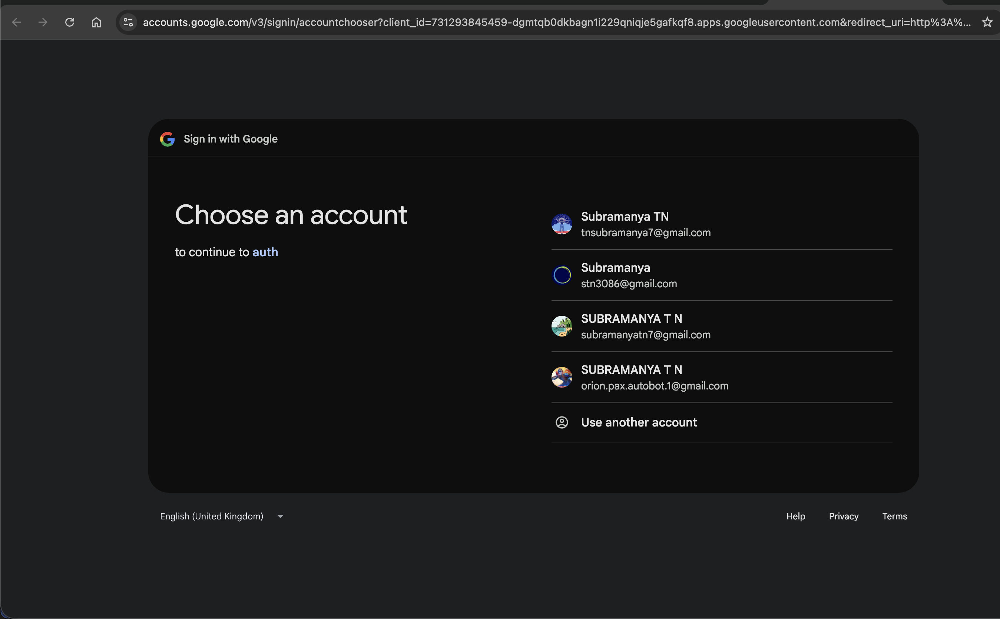
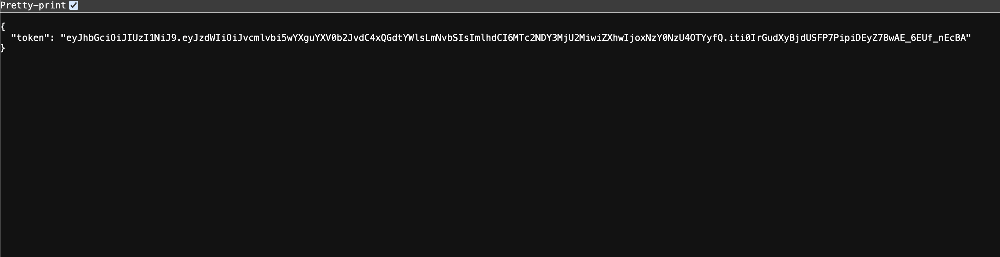
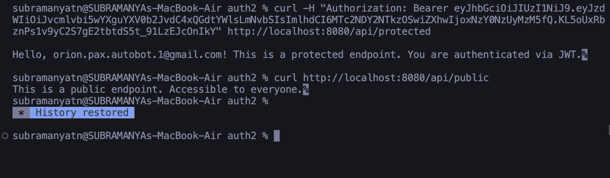

# Spring Boot OAuth2 & Stateless JWT API

A foundational Spring Boot 3 application demonstrating the separation between Google OAuth2 login and stateless JWT API access.

## 🚀 Features

*   **Google OAuth2 Login**: Secure login using Google's OAuth2 provider.
*   **Stateless Authentication**: No server-side sessions. Uses JWT (JSON Web Tokens) for API access.
*   **Secure API Endpoints**:
    *   `/api/public`: Open to everyone.
    *   `/api/protected`: Requires a valid JWT.
*   **Educational Code**: Detailed comments in every file explaining the flow and logic.

## 🛠️ Tech Stack

*   Java 21
*   Spring Boot 3.2.3
*   Spring Security 6
*   OAuth2 Client
*   JJWT (Java JWT Library)

## 📸 Screenshots

### 1. Login Flow
Redirects to Google for authentication.



### 2. Token Generation
Upon success, the server returns a signed JWT.



### 3. Protected API Access
Using the token to access the protected endpoint.



## 🏃‍♂️ How to Run

1.  **Clone the repo**:
    ```bash
    git clone https://github.com/subramanya-44/GoogleOauth-using-spring-boot.git
    ```

2.  **Configure Credentials**:
    Open `src/main/resources/application.properties` and add your Google Client ID and Secret.
    *(Note: The file in this repo has placeholders for security)*.

3.  **Run the App**:
    ```bash
    ./mvnw spring-boot:run
    ```

4.  **Test**:
    *   Go to `http://localhost:8080/login/oauth2/code/google` to login.
    *   Copy the token.
    *   Run: `curl -H "Authorization: Bearer <TOKEN>" http://localhost:8080/api/protected`
